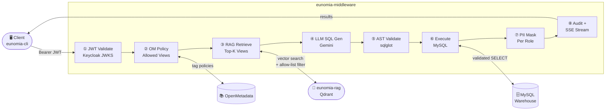
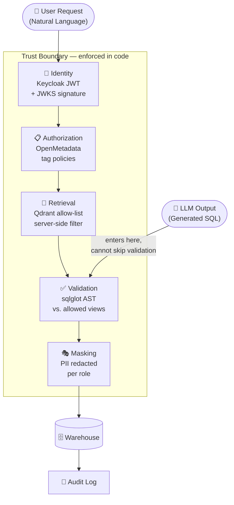

# Eunomia
{: .fs-9 }

Governance-first natural-language query middleware for LLMs on data warehouses.
{: .fs-5 .fw-300 .hero-tagline }

[Get Started](docs/quickstart.md){: .btn .btn-primary .fs-5 .mb-4 .mb-md-0 .mr-2 }
[View on GitHub](https://github.com/EunomiaAI){: .btn .fs-5 .mb-4 .mb-md-0 }

---

## The Problem

LLM-driven analytics that trust the model with sensitive data is **theater**.

When a system relies on the LLM to "be careful" — to avoid querying tables it shouldn't, to not leak PII, to stay within a user's authorized scope — you have no real security. You have a model that works until it doesn't.

**Eunomia draws the trust boundary in code, not in the prompt.** Every request is validated against hard enforcement layers before a single row is read from the warehouse. The model is a producer, never an authorizer.

---

## Architecture: The 8-Layer Pipeline

A single natural-language question passes through eight layers, each independently enforced:



---

## Design Philosophy: The Trust Boundary

Every piece of data the user sees passes through a verifiable enforcement chain:



The LLM output enters the pipeline at validation — it cannot bypass identity, authorization, or retrieval. An attacker who compromises the model still cannot access unauthorized data.

---

## Design Principles

<div class="principle-grid">
  <div class="principle-card">
    <h4>🔐 Identity is verified, not trusted</h4>
    <p>Every request carries a Keycloak JWT validated against the realm's JWKS. No hardcoded role maps. No trust-on-arrival.</p>
  </div>
  <div class="principle-card">
    <h4>📚 Authorization lives in the catalog</h4>
    <p>OpenMetadata tag policies decide who can see what. The middleware enforces; it never decides. Role maps don't live in code.</p>
  </div>
  <div class="principle-card">
    <h4>🧠 RAG ranks; OM authorizes</h4>
    <p>Qdrant filters by the user's allow-list as a server-side payload condition. Index drift cannot become an authorization bug.</p>
  </div>
  <div class="principle-card">
    <h4>✅ Validate before execute</h4>
    <p>sqlglot parses every LLM-generated query and checks each table reference against the full authorized scope. No exceptions.</p>
  </div>
  <div class="principle-card">
    <h4>🎭 PII masking per role</h4>
    <p>Column-level redaction applied at result time, based on OM tags and JWT role claims. Views can be broad; exposure is narrow.</p>
  </div>
  <div class="principle-card">
    <h4>📜 Audited end-to-end</h4>
    <p>Every query logged: identity, roles, SQL, allowed views, execution time, rows returned, masked columns. Full trace always available.</p>
  </div>
</div>

---

## Four Repos, One Stack

<div class="repo-grid">
  <a class="repo-card" href="https://github.com/EunomiaAI/eunomia-middleware">
    <div class="repo-name">eunomia-middleware</div>
    <p>FastAPI policy enforcement core — JWT validation, OM policy lookup, LLM orchestration, sqlglot validation, PII masking, audit.</p>
  </a>
  <a class="repo-card" href="https://github.com/EunomiaAI/eunomia-rag">
    <div class="repo-name">eunomia-rag</div>
    <p>Catalog-aware retrieval service. Qdrant + sentence-transformers (MiniLM-L6-v2). Server-side allow-list filtering. Cron-driven index refresh.</p>
  </a>
  <a class="repo-card" href="https://github.com/EunomiaAI/eunomia-cli">
    <div class="repo-name">eunomia-cli</div>
    <p>Typer CLI client. OAuth 2.0 device-code login, token caching (mode 0600), auto-refresh, SSE streaming with live progress output.</p>
  </a>
  <a class="repo-card" href="https://github.com/EunomiaAI/eunomia-infrastructure">
    <div class="repo-name">eunomia-infrastructure</div>
    <p>Docker-compose stack: Keycloak, OpenMetadata, MySQL, Elasticsearch, Qdrant. Seeded realm + 30-case end-to-end verification harness.</p>
  </a>
</div>

---

## Quick Example

```bash
$ eunomia-cli login
  Logged in as finance.alice
  roles: [eunomia-finance-user]

$ eunomia-cli ask "What is our daily revenue last week?"

  > Validating JWT...              ✓
  > Fetching authorized views...   ✓  2 views
  > RAG retrieval...               ✓  finance_daily_revenue_view (0.87)
  > Generating SQL...              ✓
  > Validating AST...              ✓  all tables authorized
  > Executing query...             ✓  7 rows / 45ms
  > Applying PII masking...        ✓  0 columns masked

  ┌────────────┬───────────────┐
  │ order_date │ total_revenue │
  ├────────────┼───────────────┤
  │ 2026-05-07 │     45000.00  │
  │ 2026-05-08 │     52000.00  │
  │     ...    │       ...     │
  └────────────┴───────────────┘
```

---

## License

Apache 2.0 — [view source on GitHub](https://github.com/EunomiaAI)
